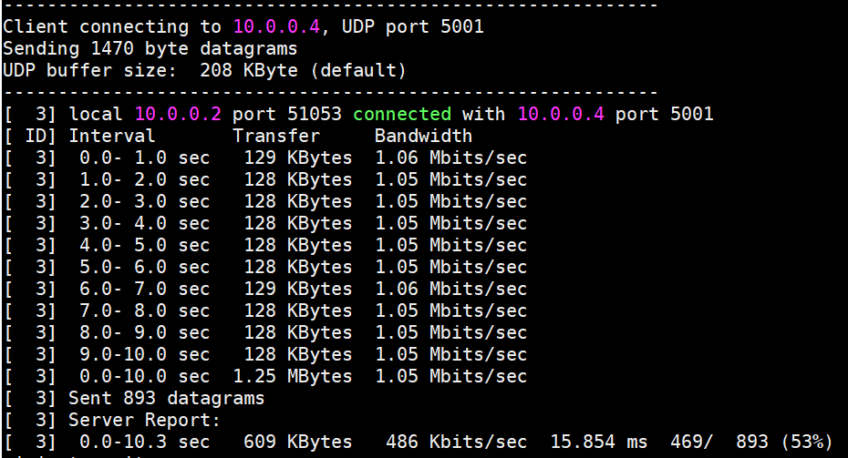

# Network Topology with Mininet

This repository is lab for NCTU course "Introduction to Computer Networks 2018".

---
## Abstract

In this lab, we are going to write a Python program which can generate a network topology using Mininet and use iPerf to measure the bandwidth of the topology.

---
## Objectives

1. Learn how to create a network topology with Mininet
2. Learn how to measure the bandwidth in your network topology with iPerf

---
## Execution

After finishing the topology.py, type 

    $ ./topologt.py

then you will enter in the Mininet's CLI mode.

Use the following iPerf commands to measure the topology.

    

Then you will see the result approximately similar to the following, 

    

---
## Description

### Mininet API in Python

There are three parts in my code: the class "MyTopo", the function "simpleTest", and main function.

1. MyTopo

   The goal of this class is to build swtiches, hosts, and links. I use the in-built function "addSwitch(name)", "addHost(name)", and addLinks(name,name,bw,delay,loss) to control parameters and fulfill the goal.
   
2. simpleTest()

   In this function, I call the class "MyTopo" to build the topology. Then Create and manage a network with a OvS controller and use TCLink using " net = Mininet( topo = topo, controller = OVSController, link = TCLink)". TCLink means Traffic Control Link. It is necessary so that we can set bandwidth, delay, and loss in a link.
   
   After, start the network by "net.start()" and check connectivity by "net.pingAll()", and then dump every hosts and switches to see the connections by "dumpNodeConnections(net.hosts)" and "dumpNodeConnections(net.switches)".
   
   Finally, "CLI(net)" means enter in the Mininet's CLI mode.
   
3. main function

   Tell mininet to print useful information by "setLogLevel('info')" and execute the function "simpleTest()".

### iPerf Commands

1. h2 iperf -s -u -i 1 > ./out/result &

       * -s : run iPerf in server mode
  
       * -u : Use UDP rather than TCP 
  
       * -i 1 : a report is made every 1 second of the bandwidth since the last report
  
       * /out/result & : write the report in file result
  
2. h2 iperf -c 10.0.0.4 -u –i 1

       * -c : run iPerf in client mode
  
       * 10.0.0.4 : set the IP address h2 wants to connect
  
### Tasks

1. **Environment Setup**
   
   (1.) click https://classroom.github.com/a/K8gaizQG and join this lab
   
   (2.) use a toolbox for remote computing( I use MobaXterm) to connect to the container
        
        * IP address : 140.113.195.69
        
        * Port : 10119
        
        * user : root
        
        * Password : cn2018 ( after logining, change the passwd)
    
   (3.) clone GitHub repository
    
        $ git clone https://github.com/nctucn/lab2-julie200420.git Network_Topology
         
   (4.) Run Mininet for testing
   
        $ [sudo] mn

2. **Example of Mininet**

   (1.) change the directory into /src
        
        $ cd /Network_Topology/src/
        
   (2.) change to the executable mode
        
        $ chmod +x example.py
        
   (3.) Run example code
        
        $ ./example.py
        
3. **Topology Generator**

   (1.) the remainder is 1, so I should generate topo1.png
   
        
   
   (2.) Write a Python program named topology.py (refer to example.py) and put it at the same place with example.py
   
   (3.) check the connection by using following command in the Mininet's CLI mode
   
        mininet> pingall
   
        mininet> h1 ping h2
   
        mininet> links
   
        mininet> dump

4. **Measurement**

   (1.) Use the following iPerf commands to measure the topology you built. And they will dump the result of iPerf’s
measurement into the file result

        * /Network_Topology/src/out/result
   
        
   
   (2.) The expected result from the topo1.png
   
        

---
## References

* **Mininet**
    * [Mininet Walkthrough](http://mininet.org/walkthrough/)
    * [Introduction to Mininet](https://github.com/mininet/mininet/wiki/Introduction-to-Mininet)
    * [Mininet Python API Reference Manual](http://mininet.org/api/annotated.html)
    * [A Beginner's Guide to Mininet](https://opensourceforu.com/2017/04/beginners-guide-mininet/)
    * [GitHub/OSE-Lab - 熟悉如何使用 Mininet](https://github.com/OSE-Lab/Learning-SDN/blob/master/Mininet/README.md)
    * [菸酒生的記事本 – Mininet 筆記](https://blog.laszlo.tw/?p=81)
    * [Hwchiu Learning Note – 手把手打造仿 mininet 網路](https://hwchiu.com/setup-mininet-like-environment.html)
    * [阿寬的實驗室 – Mininet 指令介紹](https://ting-kuan.blog/2017/11/09/%E3%80%90mininet%E6%8C%87%E4%BB%A4%E4%BB%8B%E7%B4%B9%E3%80%91/)
    * [Mininet 學習指南](https://www.sdnlab.com/11495.html)
    * [mininet.link.TCIntf | Mininet 应用与源码剖析 - yeasy](https://yeasy.gitbooks.io/mininet_book/module_link/tcintf.html)
* **Python**
    * [Python 2.7.15 Standard Library](https://docs.python.org/2/library/index.html)
    * [Python Tutorial - Tutorialspoint](https://www.tutorialspoint.com/python/)
* **Others**
    * [iPerf3 User Documentation](https://iperf.fr/iperf-doc.php#3doc)
    * [Cheat Sheet of Markdown Syntax](https://www.markdownguide.org/cheat-sheet)
    * [Vim Tutorial – Tutorialspoint](https://www.tutorialspoint.com/vim/index.htm)
    * [鳥哥的 Linux 私房菜 – 第九章、vim 程式編輯器](http://linux.vbird.org/linux_basic/0310vi.php)

---
## Contributors

> TODO:
> * Please replace "YOUR_NAME" and "YOUR_GITHUB_LINK" into yours

* [Chen Liu](https://github.com/julie200420)
* [David Lu](https://github.com/yungshenglu)

---
## License

GNU GENERAL PUBLIC LICENSE Version 3
